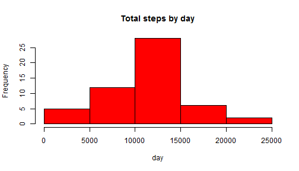
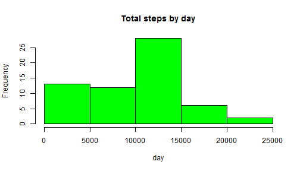
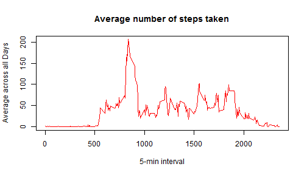
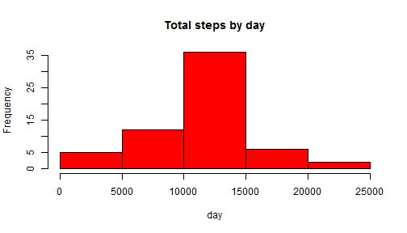

# Reproducible Research: Peer Assessment 1


## Loading and preprocessing the data

```r
activity <- read.csv("activity.csv", colClasses = c("numeric", "character", 
    "numeric"))
head(activity)
```

```
##   steps       date interval
## 1    NA 2012-10-01        0
## 2    NA 2012-10-01        5
## 3    NA 2012-10-01       10
## 4    NA 2012-10-01       15
## 5    NA 2012-10-01       20
## 6    NA 2012-10-01       25
```

```r
names(activity)
```

```
## [1] "steps"    "date"     "interval"
```


```r
library(lattice)
```


```r
activity$date <- as.Date(activity$date, "%Y-%m-%d")
```


## What is mean total number of steps taken per day?

I will use to approaches 

First is using aggregate function


```r
StepsTotal <- aggregate(steps ~ date, data = activity, sum, na.rm = TRUE)
```


The Histogram is 

```r
hist(StepsTotal$steps, main = "Total steps by day", xlab = "day", col = "red")
```

 

And the mean and median is

```r
mean(StepsTotal$steps)
```

```
## [1] 10766
```

```r
median(StepsTotal$steps)
```

```
## [1] 10765
```


The second approach is to make a data frame first with the values that I need
I create a data frame with the days and the total of steps by day


```r
steps <- rep(NA, 61)
day <- rep("NA", 61)
stepsday <- tapply(activity$steps, activity$date, sum, na.rm = T)
length(stepsday)
```

```
## [1] 61
```

```r
for (i in 1:61) {
    steps[i] <- stepsday[[i]]
    day[i] <- names(stepsday)[i]
}
```

then the data frame is 

```r
df <- data.frame(day, steps)
head(df)
```

```
##          day steps
## 1 2012-10-01     0
## 2 2012-10-02   126
## 3 2012-10-03 11352
## 4 2012-10-04 12116
## 5 2012-10-05 13294
## 6 2012-10-06 15420
```

Now i make the histogram


```r
hist(df$steps, main = "Total steps by day", xlab = "day", col = "green")
```

 

This second histogram is a bit differnt because the are some day that we have no data for the steps.

## What is the average daily activity pattern?

Make a time series plot (i.e. type = "l") of the 5-minute interval (x-axis)
and the average number of steps taken, averaged across all days (y-axis)

Now I get mean of steps and time series plot

```r
time_series <- tapply(activity$steps, activity$interval, mean, na.rm = TRUE)
```

The plot is:


```r
plot(row.names(time_series), time_series, type = "l", xlab = "5-min interval", 
    ylab = "Average across all Days", main = "Average number of steps taken", 
    col = "red")
```

 


Which 5-minute interval, on average across all the days in the dataset,
contains the maximum number of steps?


```r
max_interval <- which.max(time_series)
names(max_interval)
```

```
## [1] "835"
```


## Imputing missing values

Calculate and report the total number of missing values in the dataset
(i.e. the total number of rows with NAs)


```r
activity_NA <- sum(is.na(activity))
activity_NA
```

```
## [1] 2304
```

Devise a strategy for filling in all of the missing values in the dataset. The
strategy does not need to be sophisticated. For example, you could use
the mean/median for that day, or the mean for that 5-minute interval,etc

Fist Na replaced by mean in 5 min interval

```r
StepsAverage <- aggregate(steps ~ interval, data = activity, FUN = mean)
fillNA <- numeric()
for (i in 1:nrow(activity)) {
    obs <- activity[i, ]
    if (is.na(obs$steps)) {
        steps <- subset(StepsAverage, interval == obs$interval)$steps
    } else {
        steps <- obs$steps
    }
    fillNA <- c(fillNA, steps)
}
```

Create a new dataset that is equal to the original dataset but with the
missing data filled in.

```r
new_activity <- activity
new_activity$steps <- fillNA
```

Make a histogram of the total number of steps taken each day and Calculate
and report the mean and median total number of steps taken per day. Do
these values differ from the estimates from the first part of the assignment?
What is the impact of imputing missing data on the estimates of the total
daily number of steps?


```r
StepsTotal2 <- aggregate(steps ~ date, data = new_activity, sum, na.rm = TRUE)
```


The Histogram is 

```r
hist(StepsTotal2$steps, main = "Total steps by day", xlab = "day", col = "red")
```

 

And the mean and median is

```r
mean(StepsTotal2$steps)
```

```
## [1] 10766
```

```r
median(StepsTotal2$steps)
```

```
## [1] 10766
```

After replacing the mean is the same but the median is a little bit different


## Are there differences in activity patterns between weekdays and weekends?

For this part the weekdays() function may be of some help here. Use the dataset
with the filled-in missing values for this part.

Create a new factor variable in the dataset with two levels – “weekday”
and “weekend” indicating whether a given date is a weekday or weekend
day.


```r
day <- weekdays(activity$date)
daylevel <- vector()
for (i in 1:nrow(activity)) {
    if (day[i] == "Saturday") {
        daylevel[i] <- "Weekend"
    } else if (day[i] == "Sunday") {
        daylevel[i] <- "Weekend"
    } else {
        daylevel[i] <- "Weekday"
    }
}
activity$daylevel <- daylevel
activity$daylevel <- factor(activity$daylevel)

stepsByDay <- aggregate(steps ~ interval + daylevel, data = activity, mean)
names(stepsByDay) <- c("interval", "day_type", "steps")
```


Make a panel plot containing a time series plot (i.e. type = "l") of the
5-minute interval (x-axis) and the average number of steps taken, averaged
across all weekday days or weekend days (y-axis). The plot should look
something like the following, which was creating using simulated data:


```r
xyplot(steps ~ interval | daylevel, stepsByDay, type = "l", layout = c(1, 2), 
    xlab = "Interval", ylab = "Number of steps")
```

 

